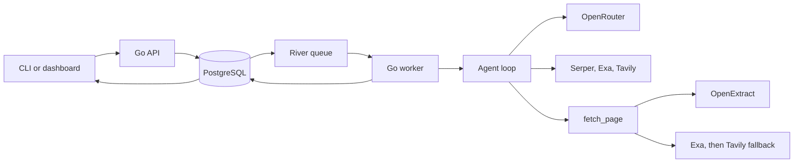

# Architecture

Freegent accepts spreadsheet rows, stores them in PostgreSQL, and processes each row as an independent River job.

## Components

| Component | Responsibility |
|---|---|
| `cmd/freegent` | Starts CLI, API, or worker mode |
| `internal/cli` | Submits work, polls jobs, and downloads results |
| `internal/api` | Owns HTTP routes, PostgreSQL state, River jobs, and embedded dashboard assets |
| `internal/api/dashboard` | Vite, React, and Tailwind dashboard source |
| `internal/config` | Loads provider configuration once at worker startup |
| `internal/agent` | Runs model and tool calls and validates final answers |
| `internal/tools` | Provides search, page fetching, and optional Apify enrichment |
| `internal/openextract` | Calls the standalone OpenExtract HTTP API |
| `ghcr.io/simonbalfe/openextract` | Retrieves and cleans public URLs through the standalone service image |

## Job flow

1. The CLI or dashboard sends rows to `POST /jobs`.
2. The API stores the batch and its rows in PostgreSQL.
3. The API inserts one River operation for each row in the same transaction.
4. A worker claims an operation and runs the complete agent loop.
5. Successful model and tool calls are stored on the row before the loop continues.
6. The worker stores progress, evidence, errors, and the final result.
7. The CLI polls the job and streams JSON or CSV output.

River may deliver a job more than once. A worker checks the row state before running it, so completed rows are not repeated.
One `fetch_page` call tries OpenExtract, then Exa, then Tavily until one returns usable content. If all configured methods fail, the agent receives a recoverable tool error and can search for another source. River still retries transient operation failures.
An invalid answer or transient finalizer request failure gets one local finalizer retry. Research tools are not repeated.
Each row reuses identical tool results and finalizes after six successful tool calls.
Shared business-field instructions prefer current company-owned evidence, reject slogan-based customer segments, and use current whole-product categories.

## Durable replay

Each successful model, tool, and finalizer call is stored in the row's `step_results` JSON object.
The key includes a replay version, the operation type, the model or tool identity, and the exact input.
A retried row starts the agent loop again and reuses matching results until it reaches the first missing call.
Errors are not stored. New jobs never reuse results from older jobs.

Step commits are first-writer-wins. A provider call can still repeat if a worker dies after the provider responds but before PostgreSQL records the result.
Change `operationStepVersion` when an incompatible runtime change must invalidate stored steps for jobs already in flight.

Workers stop claiming jobs on `SIGTERM`, give active rows 30 seconds to finish, then cancel remaining work.
River rescues a worker lost without graceful shutdown after the operation timeout plus one minute.

## Data ownership

PostgreSQL stores:

- jobs and row state
- River queue state
- progress events
- successful external step results
- evidence and results
- errors and token usage

OpenExtract is stateless.

## Main routes

| Route | Purpose |
|---|---|
| `GET /health` | Check API and database health |
| `POST /jobs` | Submit JSON rows or a CSV |
| `GET /jobs/{id}` | Read job state |
| `GET /jobs/{id}/results.csv` | Download enriched CSV output |
| `/dashboard` | Embedded React spreadsheet with research output columns and a separate row analytics view |
