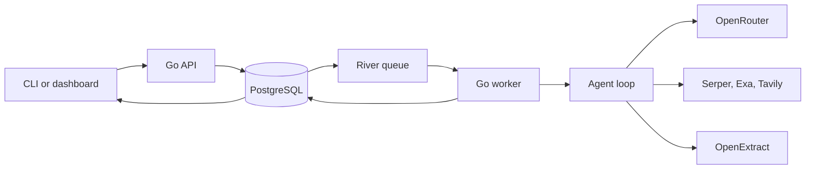

# Architecture

Freegent accepts spreadsheet rows, stores them in PostgreSQL, and processes each row as an independent River job.

## Components

| Component | Responsibility |
|---|---|
| `cmd/freegent` | Starts CLI, API, or worker mode |
| `internal/cli` | Submits work, polls jobs, and downloads results |
| `internal/api` | Owns HTTP routes, PostgreSQL state, River jobs, and the dashboard |
| `internal/agent` | Runs model and tool calls and validates final answers |
| `internal/tools` | Provides search, page fetching, and optional Apify enrichment |
| `internal/openextract` | Calls the standalone OpenExtract HTTP API |
| `ghcr.io/simonbalfe/openextract` | Retrieves and cleans public URLs through the standalone service image |

## Job flow

1. The CLI or dashboard sends rows to `POST /jobs`.
2. The API stores the batch and its rows in PostgreSQL.
3. The API inserts one River operation for each row in the same transaction.
4. A worker claims an operation and runs the complete agent loop.
5. The worker stores progress, evidence, errors, and the final result.
6. The CLI polls the job and streams JSON or CSV output.

River may deliver a job more than once. A worker checks the row state before running it, so completed rows are not repeated.

## Data ownership

PostgreSQL stores:

- jobs and row state
- River queue state
- progress events
- evidence and results
- errors and token usage

OpenExtract is stateless.

## Main routes

| Route | Purpose |
|---|---|
| `GET /health` | Check API and database health |
| `POST /jobs` | Submit JSON rows or a CSV |
| `GET /jobs/{id}` | Read job state |
| `GET /jobs/{id}/results.csv` | Download enriched CSV output |
| `/dashboard` | Submit and inspect jobs in a browser |
