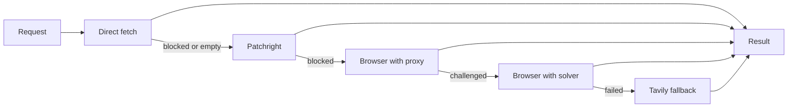

# OpenExtract

OpenExtract is a standalone TypeScript HTTP service. It turns a public URL into clean text, structured data, and discovered links.

The Go API does not know how extraction works. Workers call OpenExtract through `OPENEXTRACT_URL`.

## Extraction flow



Unavailable proxy, solver, or Tavily steps are skipped and recorded in the response.

## API

Health:

```bash
curl http://localhost:8081/healthz
```

Extract:

```bash
curl -sS http://localhost:8081/extract \
  -H 'content-type: application/json' \
  -d '{"url":"https://www.iana.org/help/example-domains"}'
```

`POST /extract` returns the cleaned content, content type, provider, outcome, links, and every attempt.

## Capacity

OpenExtract uses in-memory limits:

- `OPENEXTRACT_MAX_CONCURRENCY` limits active extractions. Default: `20`.
- `OPENEXTRACT_BROWSER_CONCURRENCY` limits browser contexts. Default: `4`.
- `OPENEXTRACT_MAX_WAITING` limits queued requests. Default: `100`.

When the waiting queue is full, OpenExtract returns HTTP `429` with `Retry-After: 1`. River remains the durable retry queue.

`OPEN_EXTRACT_DEBUG=1` enables extraction debug logging.

## Run it

From the repository root:

```bash
cd openextract
bun install
bun run typecheck
bun run start
```

Build its Docker image:

```bash
docker build -t openextract ./openextract
```

The service has no authentication or private-network URL filtering. Keep it on a private network or place it behind an authenticated gateway.

## Separate repository

OpenExtract can move into its own repository because it already has:

- its own source, package files, tests, and Dockerfile
- a standalone health route
- a small HTTP contract
- no database or River dependency

A future split must:

1. Move the OpenExtract image build to the new repository.
2. Keep `POST /extract` compatible with the Go client.
3. Change Freegent Compose to pull the external image.
4. Update installer fallback behavior and documentation.

Related research:

- [OpenExtract context selection](research/openextract-context-selection.md)
- [ZenRows managed extraction comparison](research/zenrows.md)
